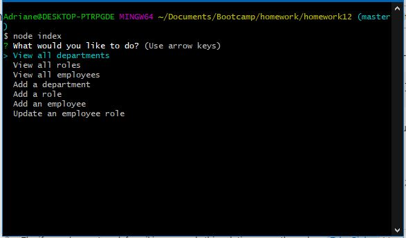

# Project Name - Employee Tracker
​
## Table of contents
​
- [Overview](#overview)
  - [The challenge](#the-challenge)
  - [User Story](#user-story)
  - [Acceptance Criteria](#acceptance-criteria)
  - [Screenshot](#screenshot)
  - [Links](#links)
- [My process](#my-process)
  - [Built with](#built-with)
  - [What I learned](#what-i-learned)
  - [Continued development](#continued-development)
  - [Useful resources](#useful-resources)
- [Author](#author)
​
## Overview
​
### The challenge
​
Create a command line application to manage company's employee database using Node.js, Inquirer and MySQL
​
### User Story
​
```
AS A business owner
I WANT to be able to view and manage the departments, roles, and employees in my company
SO THAT I can organize and plan my business
```
​
### Acceptance Criteria
​
```
GIVEN a command-line application that accepts user input
WHEN I start the application
THEN I am presented with the following options: view all departments, view all roles, view all employees, add a department, add a role, add an employee, and update an employee role
WHEN I choose to view all departments
THEN I am presented with a formatted table showing department names and department ids
WHEN I choose to view all roles
THEN I am presented with the job title, role id, the department that role belongs to, and the salary for that role
WHEN I choose to view all employees
THEN I am presented with a formatted table showing employee data, including employee ids, first names, last names, job titles, departments, salaries, and managers that the employees report to
WHEN I choose to add a department
THEN I am prompted to enter the name of the department and that department is added to the database
WHEN I choose to add a role
THEN I am prompted to enter the name, salary, and department for the role and that role is added to the database
WHEN I choose to add an employee
THEN I am prompted to enter the employee’s first name, last name, role, and manager, and that employee is added to the database
WHEN I choose to update an employee role
THEN I am prompted to select an employee to update and their new role and this information is updated in the database
```
​
### Screenshot
​

​
### Links
​
- Recording: [Whatch this please!](https://drive.google.com/file/d/1m0GBXc9aoy04ZTmHZRdQ4L47TBPJ5sMQ/view)

​
## My process
​
### Built with
​
- Node.js
- Inquirer
- MySQL
- console.table package

### What I learned
​
I was able to learn and implement node.js more in command line applications. I was also able to implement packages such as inquirer, mysql and console.table. Although I have used inquirer in previous homeworks, I was able to implement several layers of prompts because I learned how to use asynchronous functions. With asynchronous functions, obtaining results from the function were easier. 
​
### Continued development
​
As I implemented inquirer, I learned that there is so much more to do with it. I feel like I have only touched the surface on how to use inquirer. MySQL is also a powerful tool to work with databases. I was able to use references to connect several tables, but there are different ways to display data that I have not learned. 
​
### Useful resources
​
- [Example resource 1](https://stackoverflow.com/questions/61262212/how-to-make-a-function-to-query-mysql-in-nodejs) - This question and answer pointed me the right direction to make asynchronous functions. 
- [Example resource 2](https://www.npmjs.com/package//inquirer?activeTab=readme) - Inquirer's documentation helped me figure out the format and paramters. 
- [Ex 3](https://www.w3schools.com/sql/default.asp) - 
- [Ex 4](https://javascript.info/async-await) -

## Author
​
- Website - [Adriane Ocampo](https://ocampoad.github.io/Adriane_Ocampo_Portfolio/)
